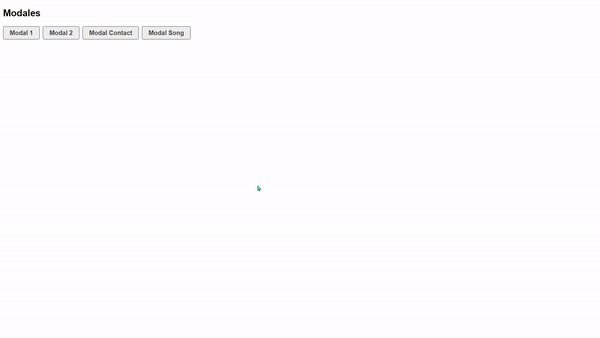
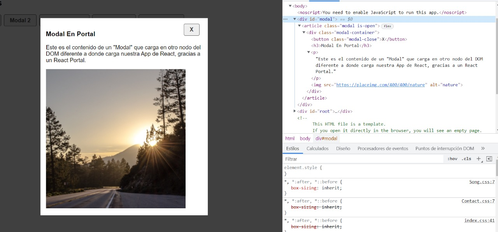

# Ventana Modal en REACT

Un modal es un cuadro emergente que aparece en respuesta a alguna acción del usuario.

Se crearon componentes para presentar y se copiaron otros componentes de otros proyectos y se reutilizaron.

### `Gracias JM!`

.gif>)
.gif>)
.gif>)

### `Creacion de Portales`

Creamos un portal mas, diferente al que viene por defecto que es el root

